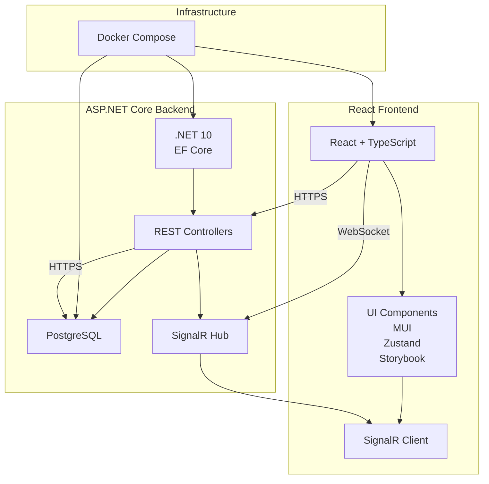
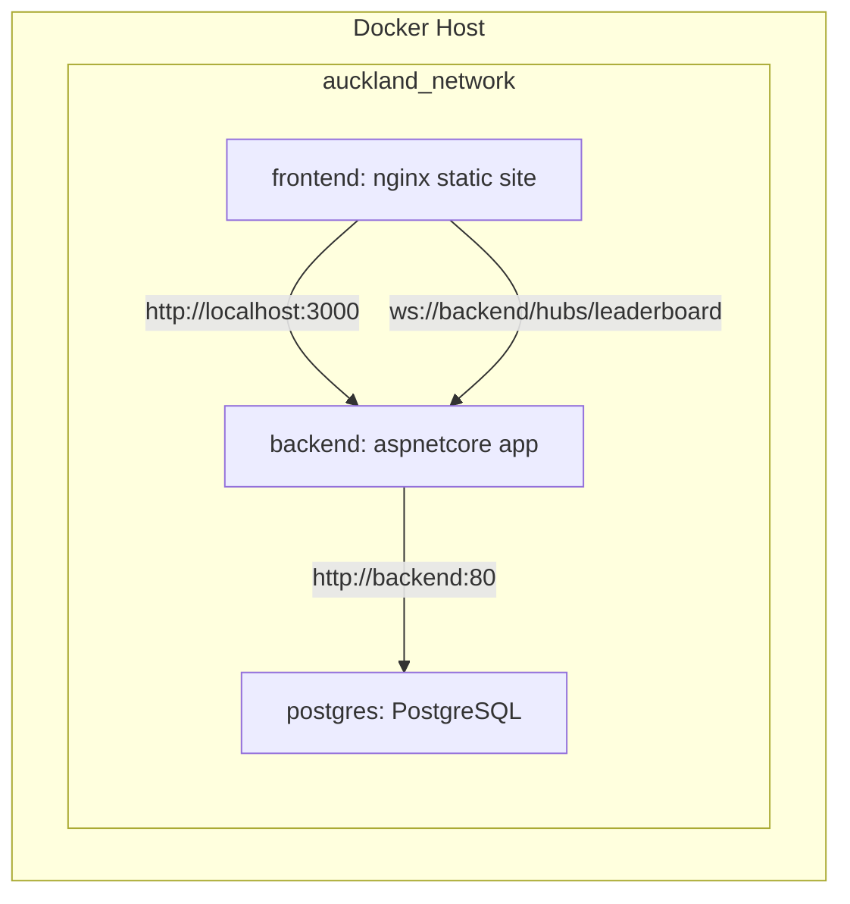

# Auckland Quest – Architecture Design Document

---

## 1. System Layer Diagram


**Explanation**
- **Frontend** uses React (TypeScript) for SPA, MUI for theming, Zustand for global state, and @microsoft/signalr to receive real‑time updates.
- **Backend** is an ASP.NET Core Web API (.NET 10) exposing REST endpoints, handling authentication/authorization (JWT, RBAC) and talking to PostgreSQL via EF Core. A SignalR hub pushes leaderboard/likes/online‑user events.
- **Infrastructure** is Docker‑Compose‑orchestrated, each service runs in its own container, all reachable via a private Docker network.

---

## 2. Docker‑Compose Deployment Topology



**docker‑compose.yml (excerpt)**
```yaml
version: "3.9"
services:
  db:
    image: postgres:16-alpine
    environment:
      POSTGRES_USER: auckland
      POSTGRES_PASSWORD: secret
      POSTGRES_DB: questdb
    volumes:
      - db_data:/var/lib/postgresql/data
    networks:
      - auckland_network

  backend:
    build: ./backend
    environment:
      - ConnectionStrings__Default=Host=db;Port=5432;Database=questdb;Username=auckland;Password=secret
      - Jwt__Key=SuperSecretKeyForJwt
    depends_on:
      - db
    ports:
      - "5000:80"
    networks:
      - auckland_network

  frontend:
    build: ./frontend
    depends_on:
      - backend
    ports:
      - "3000:80"
    networks:
      - auckland_network

networks:
  auckland_network:
    driver: bridge

volumes:
  db_data:
``` 

---

## 3. Technology Selection Rationale

| Layer | Technology | Why this choice? |
|-------|------------|-----------------|
| **Frontend UI** | **React + TypeScript** | Declarative UI, strong ecosystem, static typing prevents runtime errors; aligns with modern industry practice. |
| **Component Library** | **MUI (Material‑UI)** | Provides accessible, themable components out‑of‑the‑box; supports dark mode via theme overrides. |
| **State Management** | **Zustand** | Minimal boilerplate, stores are simple objects, works well with React 18 concurrent features; no need for Redux complexity. |
| **Real‑time** | **SignalR (ASP.NET Core + @microsoft/signalr)** | Native WebSocket abstraction for .NET, automatic reconnection, strongly‑typed hub methods – perfect for leaderboard & online‑user updates. |
| **Backend Framework** | **ASP.NET Core 10** | High performance, cross‑platform, built‑in DI, excellent tooling for EF Core and SignalR. |
| **ORM** | **Entity Framework Core** | Code‑first migrations, LINQ queries, PostgreSQL provider; reduces boiler‑plate data access code. |
| **Database** | **PostgreSQL** | Open‑source, reliable, supports JSONB (useful for flexible quest metadata) and robust ACID guarantees. |
| **Authentication** | **JWT + BCrypt** | Stateless tokens simplify scaling; BCrypt provides strong password hashing. |
| **Authorization** | **RBAC** (policy‑based) | Clear separation of privileges (User vs Admin vs CommunityEditor). |
| **Containerisation** | **Docker + Docker‑Compose** | Guarantees identical dev, test, and production environments; one‑click start for the whole stack. |
| **Testing** | **xUnit (backend), Jest + React Testing Library (frontend), Cypress (E2E)** | Comprehensive unit, integration, and end‑to‑end coverage; CI can run all suites automatically. |
| **Component Documentation** | **Storybook** | Enables UI component isolation, visual regression testing, and a living style guide for developers and designers. |
| **CI/CD** | **GitHub Actions** | Build images, run tests, push to GitHub Packages, and optionally deploy to Azure Web App with a single workflow. |

---

## 4. Summary
The architecture is intentionally **modular**, **cloud‑ready**, and **developer‑friendly**. Each service can be scaled independently; the SignalR hub provides low‑latency real‑time interactivity; Docker guarantees reproducibility; and the selected libraries maximise productivity while keeping the codebase maintainable.

---

**Git Commit Suggestion**
```text
docs: add architecture design document with diagrams
```
